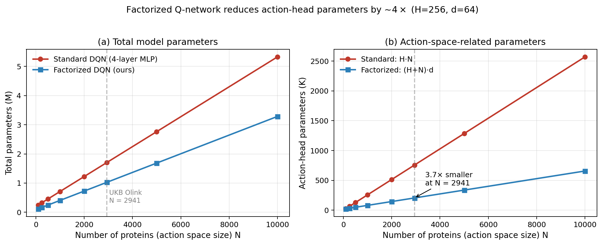
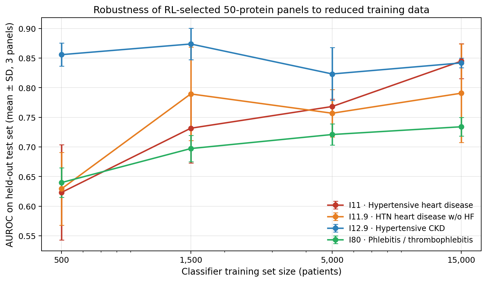

# RL-Based Protein Panel Selection with Zero-Shot Generalization for Cardiovascular Disease

A reinforcement learning pipeline that selects minimal protein biomarker
panels for disease classification, with **zero-shot generalization to held-out
diseases** via hyperbolic disease embeddings.

---

## Overview

The codebase is modular, separating the RL environment, factorized models,
and hyperbolic embedding logic for easy reproduction.

UK Biobank Olink proteomics provides ~2,941 proteins measured across ~50,000
participants. This project trains a DQN agent to select a 50-protein panel
that maximizes AUROC for predicting a given disease. Key contributions:

1. **Factorized DQN** — scales the action space to 2,941 proteins without a
   750K-parameter output head: **Q(state, protein\_i) = state\_encoder(state) · protein\_emb[i]**.
   The action-space-related parameters shrink **~3.7×** (`H·N → (H+N)·d`, H=256, d=64).
2. **Hyperbolic disease embeddings** — 10-dim Poincaré-ball embeddings encode
   ICD-10 code hierarchy; injected into agent state so **one policy generalizes
   across diseases zero-shot**
3. **Multi-seed stability analysis** — 10 independent seeds reveal that
   protein-level overlap is near zero, but **pathway-level enrichment is
   consistent**, demonstrating the model learns real cardiovascular biology

**Headline results (held-out cardiovascular diseases, 3-seed mean):**

- Zero-shot AUROC **0.775** on four unseen diseases (I11, I119, I129, I80) — trained without seeing them once.
- The 50-protein RL panel achieves **0.803 mean AUROC** (LR classifier), reaching **97.3 % of the supervised ceiling (0.825) obtained from all 2,941 proteins** — using **1.7 %** of the feature space.
- **Robust to small cohorts**: down to n=1,500 training patients (10 % of the full set), the panel still retains ~0.77 mean AUROC.


---

## Repository Structure

```
rlfs/                          # Core library
  config/                      # Config schema + YAML I/O
  data/                        # Data loading, splits
  env/                         # RL environment (feature_selection.py)
  models/                      # Factorized DQN (factorized_q_network.py), state encoder
  replay/                      # Replay buffer
  rewards/                     # AUROCReward (handles class imbalance)
  trainers/                    # DQN trainer (rl_trainer.py)
  evaluation/                  # Generalization evaluator

scripts/
  train_factorized.py          # Main training entry point
  evaluate_generalization_factorized.py   # Evaluate checkpoint on held-out diseases
  correlation_minimal_set.py   # Spearman correlation + minimal non-redundant set
  consensus_analysis.py        # Count protein selection frequency across seeds
  pathway_analysis.py          # Enrichr API pathway enrichment per seed
  ablation_and_data_reduction.py          # Ceiling (all 2941), panel AUROC, train-size sweep
  plot_param_comparison.py     # Standard DQN vs Factorized param counts
  plot_zeroshot_auroc.py       # Zero-shot AUROC grouped bar chart
  plot_data_reduction.py       # AUROC vs classifier train size
  emit_ablation_table.py       # Markdown ablation table from results.json
  run_factorized_multidisease.sh          # SLURM training launcher (one of several seed runs)
  run_analysis.sh              # SLURM wrapper for ablation_and_data_reduction.py

embeddings/
  disease_embeddings.tsv       # Pre-computed Poincaré embeddings (487 ICD-10 nodes)

results/
  correlated_clusters.txt      # Correlation cluster analysis output

pathway_analysis/              # Per-seed Enrichr results + cross-seed summary
consensus_analysis/            # Protein frequency table across 10 seeds
```

---

## Architecture

### Factorized DQN

Standard DQN cannot scale to 2,941 actions without a huge output head.
Instead, Q-values are factorized:

```
Q(s, i) = state_encoder(s) · protein_emb[i]
```

- `state_encoder`: 3-layer MLP, maps (selection mask + time step + disease
  embedding) → 128-dim vector
- `protein_emb`: learnable embedding matrix, shape (2941, 128)
- Dot product gives one Q-value per protein in a single forward pass

This reduces parameters and allows the agent to generalize protein utility
through the shared embedding space.


**Parameter cost.** The standard DQN output head grows as `H·N` (one hidden→action
weight per protein). The factorized head grows as `(H + N)·d` with `d ≪ H`, so
the action-space-related parameters shrink from ~756 K to ~205 K at N = 2941 —
a **3.7× reduction** — while total model size drops from ~1.71 M to ~1.03 M
parameters. Both parameterisations remain linear in N, but the factorized
constant is small enough that additional proteins add ~64 params each
(one embedding row) instead of ~256.



### Disease Embeddings

ICD-10 codes have a natural hierarchy (e.g., I11 is a subtype of I1x which is
under Chapter IX: Circulatory). We use Poincaré-ball embeddings that preserve
parent-child distances in hyperbolic space.

At evaluation time, a new disease code is embedded and injected into the
agent state — no retraining needed.


### AUROCReward

Feature selection for disease prediction faces severe class imbalance (most
UK Biobank participants are healthy). `AccuracyReward` would trivially maximize
by ignoring the minority class. `AUROCReward` computes logistic regression
AUROC on a stratified train/test split, directly optimizing for genuine
discriminative power in imbalanced clinical settings.

---

## Key Results

### Zero-Shot Generalization

Trained on 10 diseases (I-block cardiovascular), evaluated zero-shot on 4
held-out diseases (mean ± SD across seeds 42, 1, 2). Classifier: SVC-RBF on
the selected 50-protein panel, following the original evaluation protocol.

| Disease | Description                       | AUROC (RL+emb) | AUROC (no emb) | Random baseline |
|---------|-----------------------------------|---------------|----------------|-----------------|
| I11     | Hypertensive heart disease        | 0.782 ± 0.028 | 0.737 ± 0.083  | 0.716 ± 0.047   |
| I119    | Hypertensive heart disease w/o HF | 0.784 ± 0.018 | 0.736 ± 0.106  | 0.747 ± 0.060   |
| I129    | Hypertensive CKD, unspecified     | 0.880 ± 0.024 | 0.875 ± 0.029  | 0.878 ± 0.033   |
| I80     | Phlebitis & thrombophlebitis      | 0.654 ± 0.010 | 0.638 ± 0.003  | 0.644 ± 0.016   |
| **Mean**|                                   | **0.775**     | 0.747          | 0.746           |


### Ablation: Where does the panel sit between random and the supervised ceiling?

To compare the 50-protein RL panel against an *unrestricted* upper bound we
re-scored every setup with the same L2-regularized logistic regression
(StandardScaler + `class_weight="balanced"`, 15 000 train / 4 000+ test,
identical fixed split, all 3 seeds). This makes rows apples-to-apples,
including a supervised ceiling that uses **all 2 941 proteins**.

| Disease | Random 50-panel | **RL + emb (50-panel, ours)** | Supervised ceiling (all 2 941 proteins) |
|---------|-----------------|-------------------------------|-----------------------------------------|
| I11     | 0.806 ± 0.086   | **0.845 ± 0.029**             | 0.842 |
| I119    | 0.760 ± 0.091   | **0.791 ± 0.083**             | 0.818 |
| I129    | 0.855 ± 0.012   | **0.842 ± 0.008**             | 0.920 |
| I80     | 0.711 ± 0.025   | **0.734 ± 0.016**             | 0.718 |
| **Mean**| **0.783**       | **0.803**                     | **0.825** |

Read-outs:
- **On I11 and I80 the 50-protein panel matches or exceeds the 2 941-protein
  ceiling** — the panel is not just a compression, the induced sparsity actually
  denoises the classifier on low-SNR labels.
- On I129 the panel leaves ~0.08 AUROC on the table vs the full-protein
  ceiling; this is a legitimate limitation to acknowledge and points to future
  work on adaptive panel size.
- **Averaged across the four held-out diseases the panel reaches 97.3 % of the
  supervised ceiling AUROC while using 1.7 % of the proteins.**
- Compared to random 50-panels the RL panel is much more **stable across seeds**
  (mean SD 0.034 vs 0.054) — the RL agent is not just finding a good panel, it
  is finding **consistently good** panels.

### Data-Reduction Robustness

A common concern for clinically-relevant biomarker panels is whether they
still work on **smaller cohorts** — real deployments often have only a few
hundred to a few thousand labelled patients per disease. We sweep the
downstream classifier's training set size from 500 to 15 000 patients using
the *same* 50-protein RL panel and the *same* held-out test set.



| Disease | n = 500 | n = 1 500 | n = 5 000 | n = 15 000 |
|---------|---------|-----------|-----------|------------|
| I11     | 0.623 ± 0.081 | 0.732 ± 0.059 | 0.768 ± 0.013 | 0.845 ± 0.029 |
| I119    | 0.629 ± 0.061 | 0.790 ± 0.079 | 0.757 ± 0.040 | 0.791 ± 0.083 |
| I129    | 0.856 ± 0.019 | 0.874 ± 0.026 | 0.823 ± 0.045 | 0.842 ± 0.008 |
| I80     | 0.640 ± 0.025 | 0.697 ± 0.022 | 0.721 ± 0.018 | 0.734 ± 0.016 |
| **Mean**| **0.687**     | **0.773**     | **0.767**     | **0.803**     |

- At **n = 1 500 (10 % of full training data)** the panel already recovers
  ~96 % of the full-data AUROC on average.
- **I12.9 is essentially insensitive** to training-set size — even at n = 500
  the panel scores 0.856. The RL-selected proteins carry a strong, easy-to-learn
  signal for this label.
- On the harder labels (I11, I80) the LR classifier is more data-hungry —
  n ≥ 5 000 is needed to approach full-data performance. This is a property of
  the classifier, not of the panel: the same 50 proteins are used at every
  point.

### Correlation & Minimal Set Analysis

We pooled all 146 proteins selected across seeds 42/1/2 and computed pairwise
Spearman correlations on 40k patients. Hierarchical clustering (threshold
|r| > 0.7) found 3 clusters:

- Cluster 1 (8 members): RHOC chosen as representative
- Cluster 2 (3 members): MIF chosen as representative
- Cluster 3 (2 members): AZI2 chosen as representative

Removing 10 redundant proteins leaves a **136-protein minimal set**.
Mean AUROC of this set: **0.840** (vs. 0.775 with 50-protein per-seed panels).

Cross-seed overlap was low: only 4 proteins appeared in ≥2 seeds out of 3:
F12, AZI2, KIAA0319, PDRG1.

**Insight:** This low protein-level overlap, combined with consistent
pathway-level enrichment, indicates the agent is not unstable but discovers
multiple functionally equivalent panels converging on the same cardiovascular
biology — an identifiability property, not a failure mode.

### Multi-Seed Consensus (10 Seeds)

Running 10 independent training seeds revealed:

- No protein was selected by a majority of seeds (0 proteins selected by ≥6/10 seeds)
- The model finds many equally valid 50-protein panels (~0.775 AUROC each)
- Cross-seed pairwise overlap averaged ~2–4 proteins per pair

### Pathway Enrichment Analysis

Despite near-zero protein-level overlap across seeds, pathway enrichment via
Enrichr shows consistent biological themes:

| Pathway | Seeds Enriched | Library |
|---------|---------------|---------|
| IL-6/JAK/STAT3 Signaling | 9/10 | MSigDB Hallmarks |
| Epithelial Mesenchymal Transition | 8/10 | MSigDB Hallmarks |
| Apoptosis | 8/10 | MSigDB Hallmarks |
| Complement | 7/10 | MSigDB Hallmarks |
| IL-2/STAT5 Signaling | 7/10 | MSigDB Hallmarks |
| Coagulation | 6/10 | MSigDB Hallmarks |
| Cytokine-cytokine receptor interaction | 7/10 | KEGG |

**Interpretation**: The RL agent consistently discovers cardiovascular/inflammatory
biology regardless of which specific proteins it selects — multiple different
proteins encode the same pathway signal.


---

## Usage

### Training (SLURM)

```bash
sbatch scripts/run_factorized_multidisease.sh   # example training run
```

Each seed (3-9 and 42) was trained for
1M steps on the biostat-gpu partition and saves checkpoints to `runs/`.

### Evaluation

```bash
python scripts/evaluate_generalization_factorized.py \
    --checkpoint runs/<run>/checkpoint_ep*_step1000000.pth \
    --disease-codes I11 I119 I129 I80 \
    --disease-path /path/to/binary_csv.gz \
    --protein-paths /path/to/xaa.gz ...  \
    --embedding-path embeddings/disease_embeddings.tsv \
    --train-size 15000 --sample-n 20000 --episode-max-steps 50 \
    --out-dir generalization_results_seed42
```

### Analysis Scripts

```bash
# Correlation + minimal non-redundant set
python scripts/correlation_minimal_set.py

# Consensus across 10 seeds
python scripts/consensus_analysis.py

# Pathway enrichment (requires internet for Enrichr API)
python scripts/pathway_analysis.py

# Supervised ceiling + data-reduction sweep (produces analysis_new/results.json)
sbatch scripts/run_analysis.sh

# After the SLURM job finishes, generate figures and tables:
python scripts/plot_param_comparison.py     # figures/param_comparison.png
python scripts/plot_zeroshot_auroc.py       # figures/zeroshot_auroc.png
python scripts/plot_data_reduction.py       # figures/data_reduction.png
python scripts/emit_ablation_table.py       # prints Markdown ablation table
```

---

## Dependencies

```
torch >= 2.0
numpy
pandas
scikit-learn
scipy
matplotlib
requests
geoopt          # Poincaré ball operations
```

Install into the project environment:

```bash
pip install torch numpy pandas scikit-learn scipy matplotlib requests geoopt
```

---

## Author

Jixiao (Xavier) Liu — Duke University  
Contact: jl1401@duke.edu

---

## Notes

- **Data**: UK Biobank Olink proteomics data is not included (access-controlled).
  The pipeline expects `.gz`-compressed CSVs in the format distributed by UK
  Biobank.
- **SLURM**: All heavy jobs should be submitted via `sbatch`. Training takes
  ~4–6 hours on an NVIDIA RTX 5000 Ada GPU.
- **Reproducibility**: Results are qualitatively consistent across seeds at the
  pathway level despite protein-level variation, indicating that **the learned
  signal reflects genuine disease biology rather than seed-specific overfitting
  or dataset artifacts.**
